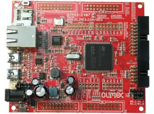

# FreeRTOS example for Olimex E407

The STM32-E407 board is open source hardware, schematics, documentation, etc as well as ordering can be found here: 
[https://www.olimex.com/Products/ARM/ST/STM32-E407/open-source-hardware](https://www.olimex.com/Products/ARM/ST/STM32-E407/open-source-hardware)

The STM32F407 is a MCU with great price/performance ratio. Featuring a 168MHz Cortex-M4 with 1MB flash memory and 192kB on-chip RAM, 
Ethernet MAC, three UARTs, and more.
